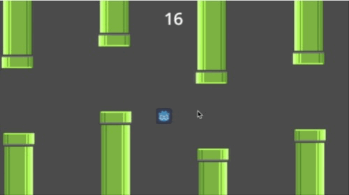
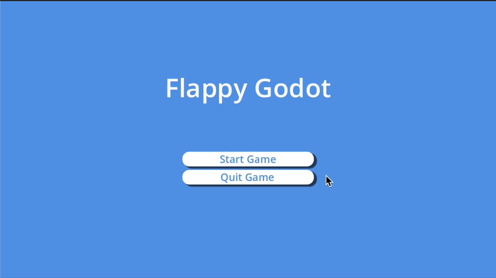
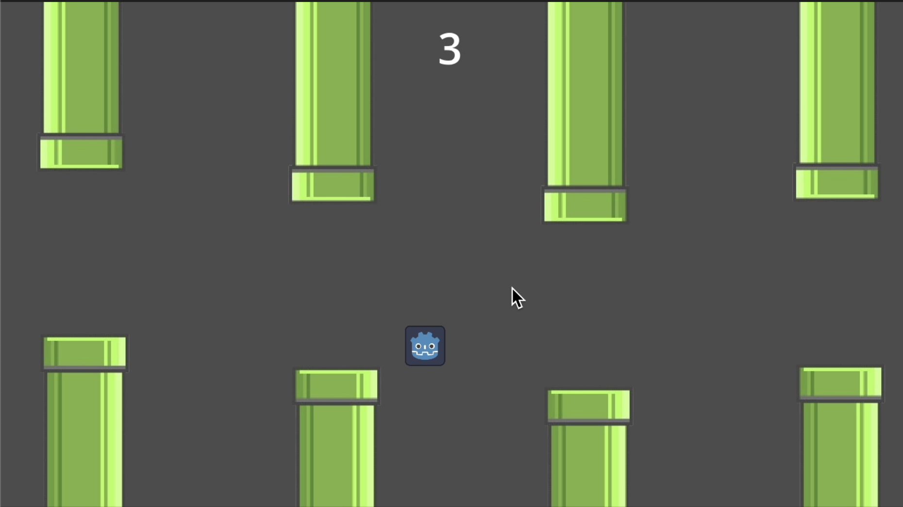
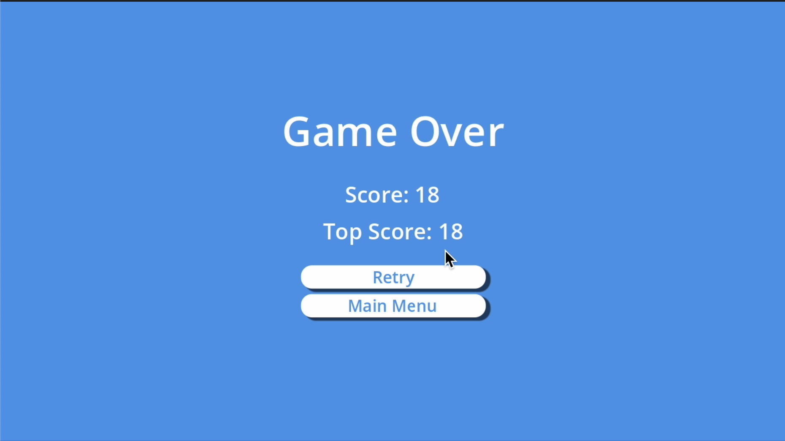

# 🐦 Flappy Godot




**Flappy Godot** é um clone do clássico **Flappy Bird**, desenvolvido utilizando a **Godot Engine**.  
Neste jogo, você controla o ícone da Godot e precisa fazê-lo voar entre os canos sem colidir!

---

# 🎮 Como Jogar

| Tecla | Ação |
|------|------|
| **Barra de Espaço (Space)** | Faz o personagem voar |

🎯 **Objetivo:**  
Desvie dos canos e tente sobreviver o máximo possível.

Cada vez que você passa por um conjunto de canos, **sua pontuação aumenta**.

---

# 🧠 Mecânicas do Jogo

- Sistema de **física com gravidade**
- **Geração procedural de canos**
- **Sistema de pontuação**
- **Detecção de colisão**

---

# 🛠️ Tecnologias Utilizadas

- **Godot Engine 4.x**
- **GDScript**

---

# 📸 Screenshots

<br><br>
<br><br>


---

# 📦 Como Rodar o Projeto

Clone o repositório:

```bash
git clone https://github.com/layon-figueiroa/flappy-godot.git
